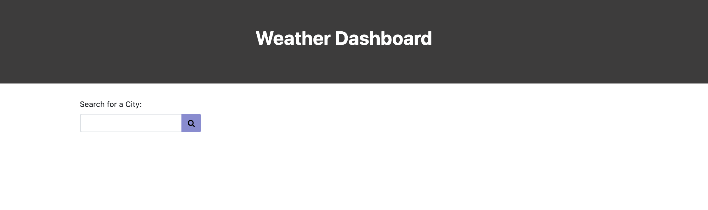
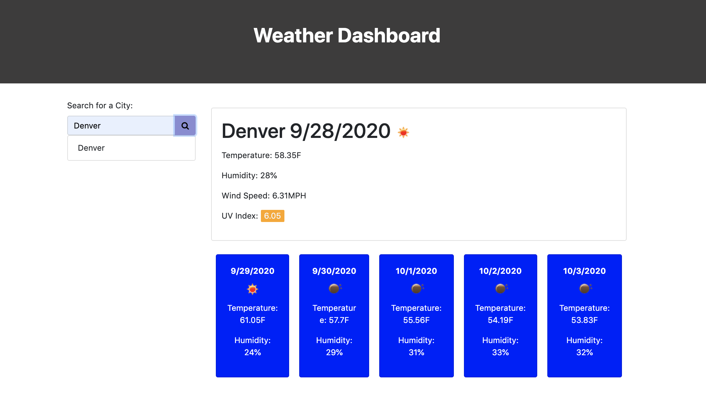
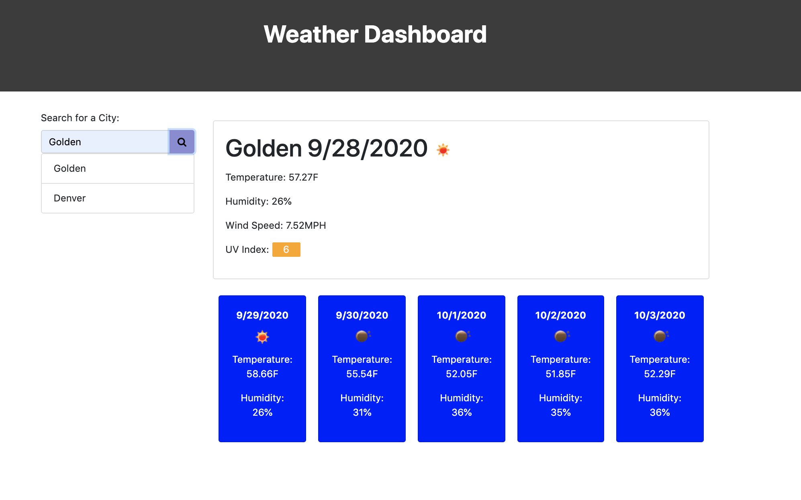
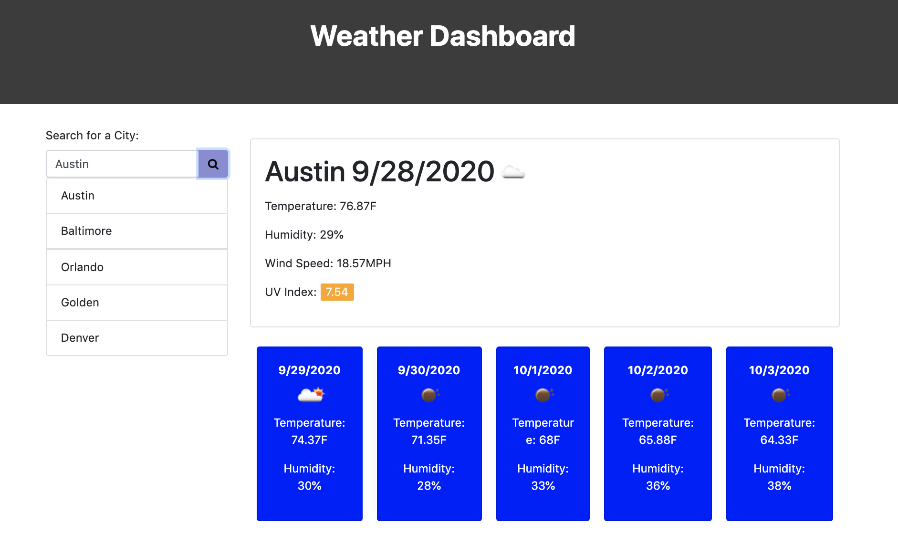

# weather-dashboard

## Table of Contents 
* [Deployed Site](#deployed-site)
* [Description](#description)
* [Usage Instructions](#usage-instructions)
* [Technologies Used](#technologies-used)
*  [Installation Instructions](#installation-instructions)
*  [Have Questions?](#have-questions)

## Deployed Site
https://anderam17.github.io/weather-dashboard/.

## Description
    This website is a weather dashboard that allows the user to search for the daily weather data and 5 day forecast of the city of their choice. After typing in their city into the input bar and pressing the search button, the right side is populated with the city name, and the day's temperature, humidity, wind speed, and uv index, as well as an icon that displays the current cloud coverage. Underneath this are 5 cards that display the next 5 day's dates, temperatures, humidities, and cloud cover icons. The city the user searched for is added to a clickable list beneath the search bar that the user can click on again to repopulate that city's data. The last city the user searches for, either by search bar or clicking on a previous city, is saved into local storage and appears whenever the user refreshes or closes and reopens the page.

## Usage Instructions

    When the user opens the app, they will see the screen above. To begin, simply type a city in the input field and search by clicking the button to the right with a magnifying glass icon.

    Afterwards, the screen will load with all the information shown above on the city the user entered. 

    At the top will be the city's name, the current date, and an icon to represent the current weather.
    Below that, the temperature, humidity, wind speed, and uv index are all listed. The uv index's number has a background color that changes depending on the uv index. 

    Below the daily weather info is a 5 day weather forecast. Each card shows the date, an icon depicting that day's weather, the predicted average temperature, and the predicted humidity. 

    As a new city is entered, a list forms underneath the input field so the user can keep track of their previous searches and revisit them by simply clicking the list item.

    What cannot be seen is that each search is saved as the last search term in local storage so that when the user closes the app and reopens it, their most recent search will appear. 

## Technologies Used

    HTML, CSS, JavaScript, Local Storage, Moment.js, JQuery

## Have Questions? 
    Contact me!
    GitHub username: anderam17
    Email: allana.anderson17@gmail.com